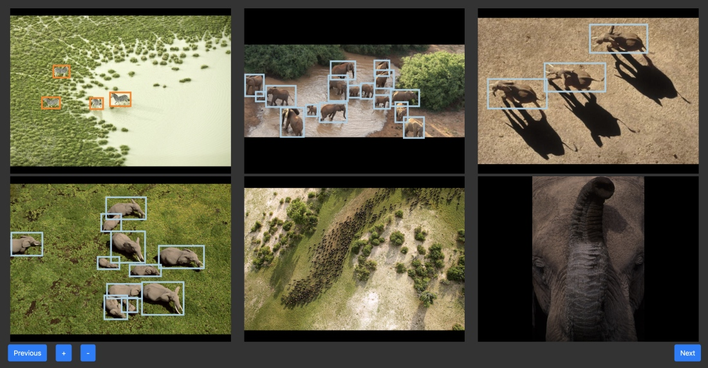

# AIde: Assisted Interface that does everything

AIde is a modular Web framework for labeling image datasets with AI assistance. AIde is configurable for a variety of tasks, but it is particularly intended for acclerating wildlife surveys that use aerial images. AIde is primarily developed by [Benjamin Kellenberger](https://www.wur.nl/en/Persons/Benjamin-BA-Benjamin-Kellenberger-MSc.htm), supported by the [Microsoft AI for Earth](https://www.microsoft.com/en-us/ai/ai-for-earth) program.

## Highlights

* **Powerful:** AIde explicitly integrates humans and AI models in an annotation loop.
* **Fast:** AIde has been designed with speed in mind, both in terms of computations and workflow.
* **Flexible:** The framework allows full customizability, from hyperparameters to models to annotation types to libraries. It provides:
    * Support for image classification, point annotations, and bounding boxes (object detection)
    * A number of AI models and Active Learning criteria [built-in](doc/builtin_models.md)
    * Interfaces for custom AI models and criteria, using any framework or library you want (see how to [write your own model](doc/custom_model.md)).
* **Modular:** AIde is separated into individual _modules_, each of which can be run on separate machines for scalability. It even supports on-the-fly addition of computational workers for computationally intensive model training!

## Framework Overview

AIde consists of individual _modules_, organized as follows:

* **LabelUI**: responsible for delivering and accepting predictions and annotations to and from the user/labeler
* **AIWorker**: runs the AI model in the background to train and predict data
* **AIController**: distributes and manages jobs to and from the individual _AIWorker_ instance(s)
* **Database**: stores all metadata (image paths, viewcounts, user annotations, model predictions, user account data, etc.)
* **FileServer**: provides image files to both the _LabelUI_ and _AIWorker_ instances
* **Message Broker**: AIde makes use of [Celery](http://www.celeryproject.org/), a distributed task queue leveraging message brokers like [RabbitMQ](https://www.rabbitmq.com/) or [Redis](https://redis.io/).

The framework can be configured in two ways:
1. As a static labeling tool (_i.e._, using only the modules in (a)). In this case there will be no AI assistance for labeling or prioritizing the relevant images.
2. As a full suite with AI support, using all modules.

The individual modules need not be run on separate instances; it is possible to combine the components in any way and launch multiple (or all) modules on one machine. For example, the diagram above shows three _AIWorker_ instances, but the number of workers can be chosen arbitrarily, and workers may be added or removed on-the-fly.

## Using a built-in AI model
AIde ships with a set of built-in models that can be configured and customized for a number of tasks (image classification, object detection, etc.).  See [this page](doc/builtin_models.md) for further instructions on how to use one of the built-in models.

## Writing your own AI model
AIde is fully modular and supports custom AI models, as long as they provide a Python interface and can handle the different annotation and prediction types appropriately. See [here](doc/custom_model.md) for details on using custom models.

## Installation

See [here](doc/install.md) for instructions on configuring an instance of AIde.

## Launching AIde

See [here](doc/launch_aide.md) for instructions on launching an instance of AIde.

## Contributing

This project welcomes contributions and suggestions.  Most contributions require you to agree to a
Contributor License Agreement (CLA) declaring that you have the right to, and actually do, grant us
the rights to use your contribution. For details, visit https://cla.opensource.microsoft.com.

When you submit a pull request, a CLA bot will automatically determine whether you need to provide
a CLA and decorate the PR appropriately (e.g., status check, comment). Simply follow the instructions
provided by the bot. You will only need to do this once across all repos using our CLA.

This project has adopted the [Microsoft Open Source Code of Conduct](https://opensource.microsoft.com/codeofconduct/).
For more information see the [Code of Conduct FAQ](https://opensource.microsoft.com/codeofconduct/faq/) or
contact [opencode@microsoft.com](mailto:opencode@microsoft.com) with any additional questions or comments.
