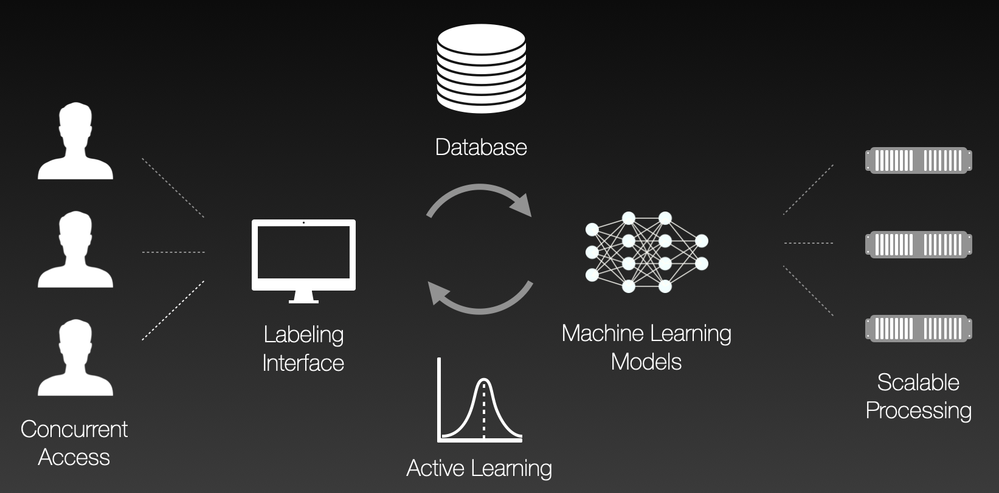
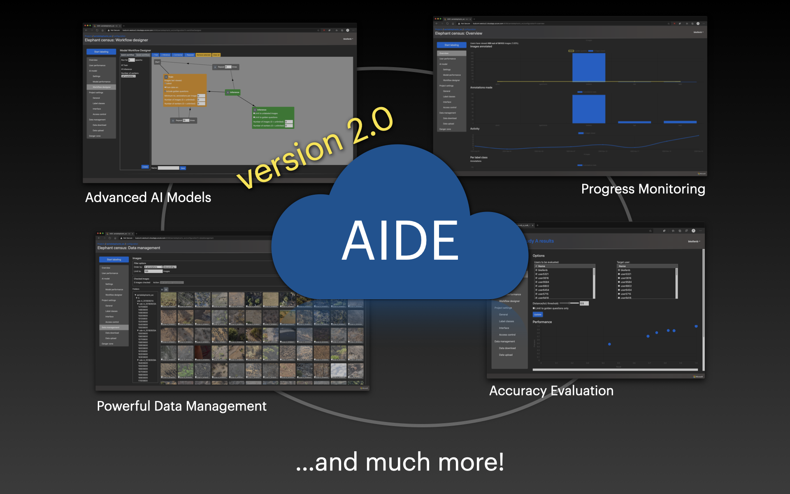

# AIDE: Annotation Interface for Data-driven Ecology

AIDE is two things in one: <i>a tool for manually annotating images</i> and <i>a tool for training and running machine (deep) learning models</i>. Those two things are coupled in an <i>active learning loop</i>: the human annotates a few images, the system trains a model, that model is used to make predictions and to select more images for the human to annotate, etc.
   
More generally, AIDE is a modular Web framework for labeling image datasets with AI assistance.  AIDE is configurable for a variety of tasks, but it is particularly intended for ecological applications, such as the acceleration wildlife surveys that use aerial images. 

AIDE is primarily developed by [Benjamin Kellenberger](https://bkellenb.github.io), supported by the [Microsoft AI for Earth](https://www.microsoft.com/en-us/ai/ai-for-earth) program.

## Contents
* [Highlights](#highlights)
* [News](#news)
* [Demo](#demo)
* [Installation and launching AIDE](#installation-and-launching-aide)
  * [Migration from AIDE v1](#migration-from-aide-v1)
  * [New installation](#new-installation)
    * [With Docker](#with-docker)
    * [Manual installation](#manual-installation)
* [AI models in AIDE](#ai-models-in-aide)
  * [Built-in AI models](#built-in-ai-models)
  * [Writing your own AI model](#writing-your-own-ai-model)
* [Publications and References](#publications-and-references)
* [Contributing](#contributing)

## Highlights

* **Powerful:** AIDE explicitly integrates humans and AI models in an annotation loop.
* **Fast:** AIDE has been designed with speed in mind, both in terms of computations and workflow.
* **Flexible:** The framework allows full customizability, from hyperparameters to models to annotation types to libraries. It provides:
    * Support for image classification, point annotations, and bounding boxes (object detection)
    * A number of AI models and Active Learning criteria [built-in](doc/builtin_models.md)
    * Interfaces for custom AI models and criteria, using any framework or library you want (see how to [write your own model](doc/custom_model.md)).
* **Fully featured:** Beyond image labeling and model training, AIDE has management and graphical user/machine performance evaluation tools built-in, right in the web browser, allowing for advanced, manual label quality checks.
* **Modular:** AIDE is separated into individual _modules_, each of which can be run on separate machines for scalability. It even supports on-the-fly addition of computational workers for computationally intensive model training!

## News

### AIDE v2 is out

We are delighted to officially announce AIDE version 2!
Highlights:
* Multi-project support: create and configure as many annotation projects as you like through the Web browser, all on one installation of AIDE.
* Powerful new models: AIDE v2 officially includes [Detectron2](https://github.com/facebookresearch/detectron2) and comes with a plethora of powerful, deep learning-based models, from ResNet over Faster R-CNN to DeepLabV3+ (see [below](#built-in-ai-models)).
* Model Marketplace: choose from a variety of pre-trained deep learning models to start with good quality predictions from the first few labels. Contribute and share your own models with other people or across projects.
* Expansive quality control: monitor the progress and accuracy of users and models with a few clicks through the browser.

There's lots more to discover. Check out the [demo](#demo) or [get started](#new-installation) straightaway!

### Older news

* **November 19, 2020:** We now have an official publication on AIDE:
Kellenberger, Benjamin, Devis Tuia, and Dan Morris. "AIDE: Accelerating image‐based ecological surveys with interactive machine learning." Methods in Ecology and Evolution 11(12), 1716-1727.
DOI: [10.1111/2041-210X.13489](https://doi.org/10.1111/2041-210X.13489).
Please cite this manuscript whenever you use AIDE in your work. Thank you very much!
* **August 17, 2020:** AIDE v2 now officially replaces the old version as the new master! If you have a v1 project running, you may want to migrate it according to the instructions [below](https://github.com/microsoft/aerial_wildlife_detection#migration-from-aide-v1). For the legacy v1 code, see [here](https://github.com/microsoft/aerial_wildlife_detection/tree/v1).
* **July 17, 2020:** AIDE now supports watching image folders for changes! Every project can be configured to automatically register newly added images and, optionally, remove all data for deleted images. See "Project Settings" > "General" and the new entry `watch_folder_interval` in the settings.ini file.
* **June 11, 2020:** The built-in RetinaNet now adapts to the project's label classes by adding or removing neurons whenever classes change! Check out the new, GUI-enhanced options in the project configuration page under "AI model" &gt; "Settings".
* **June 10, 2020:** Thanks to the outstanding work of contributor [Jarek](https://github.com/szjarek), AIDE V2 finally supports one-line installation and setup through [Docker](https://www.docker.com)! See [below](https://github.com/microsoft/aerial_wildlife_detection#with-docker) for instructions.

## Demo

A demo of AIDE v2 can be accessed **[here](http://aidedemo.westeurope.cloudapp.azure.com:8080/)**.

This demo allows exploring the annotation front-end with a number of example datasets, including:
* **[Image labels](http://aidedemo.westeurope.cloudapp.azure.com:8080/snapshot-serengeti/interface)** on the [Snapshot Serengeti camera traps dataset](http://lila.science/datasets/snapshot-serengeti)
* **[Points](http://aidedemo.westeurope.cloudapp.azure.com:8080/vgg-penguins/interface)** on the [VGG Penguins dataset](http://www.robots.ox.ac.uk/~vgg/data/penguins/)
* **[Bounding boxes](http://aidedemo.westeurope.cloudapp.azure.com:8080/arcticseals/interface)** on the [NOAA Arctic Seals aerial imagery](http://lila.science/datasets/arcticseals)
* **[Semantic segmentation](http://aidedemo.westeurope.cloudapp.azure.com:8080/landcover/interface)** on the [Chesapeake Land Cover satellite imagery](http://lila.science/datasets/chesapeakelandcover)

## Installation and launching AIDE

See [here](doc/install_overview.md).

## AI models in AIDE

### Built-in AI models

AIDE ships with a set of built-in models that can be configured and customized:

| Label type | AI model | Model variants / backbones | More info |
|-|-|-|-|
| Image labels | AlexNet | AlexNet | [paper](https://arxiv.org/abs/1404.5997) |
|  | DenseNet | DenseNet-161 | [paper](https://arxiv.org/abs/1608.06993) |
|  | MNASNet | MNASNet | [paper](https://arxiv.org/abs/1807.11626) |
|  | MobileNet | MobileNet V2 | [paper](https://arxiv.org/abs/1801.04381) |
|  | ResNet | ResNet-18; ResNet-34; ResNet-50; ResNet-101; ResNet-152 | [paper](https://arxiv.org/abs/1512.03385) |
|  | ResNeXt | ResNeXt-50; ResNeXt-101 | [paper](https://arxiv.org/abs/1611.05431) |
|  | ShuffleNet | ShuffleNet V2 | [paper](https://arxiv.org/abs/1807.11164) |
|  | SqueezeNet | SqueezeNet | [paper](https://arxiv.org/abs/1602.07360) |
|  | VGG | VGG-16 | [paper](https://arxiv.org/abs/1409.1556) |
|  | Wide ResNet | Wide ResNet-50; Wide ResNet-101 | [info](https://pytorch.org/vision/stable/models.html#wide-resnet) |
| Bounding boxes | Faster R-CNN | with ResNet-50 (PASCAL VOC); with ResNet-50 (MS-COCO); with ResNeXt-101 FPN (MS-COCO) | [paper](https://arxiv.org/pdf/1506.01497.pdf), [implementation details](https://github.com/facebookresearch/detectron2/blob/master/MODEL_ZOO.md#faster-r-cnn) |
|  | RetinaNet | with ResNet-50 FPN (MS-COCO); with ResNet-101 FPN (MS-COCO) | [paper](https://openaccess.thecvf.com/content_ICCV_2017/papers/Lin_Focal_Loss_for_ICCV_2017_paper.pdf), [implementation details](https://github.com/facebookresearch/detectron2/blob/master/MODEL_ZOO.md#retinanet) |
| Segmentation masks | DeepLabV3+ | with modified ResNet-101 (Cityscapes) | [paper](http://openaccess.thecvf.com/content_ECCV_2018/papers/Liang-Chieh_Chen_Encoder-Decoder_with_Atrous_ECCV_2018_paper.pdf), [implementation details](https://github.com/facebookresearch/detectron2/tree/master/projects/DeepLab) |

All models can be configured in various ways through the AI model settings page in the Web browser. They all are pre-trained on [ImageNet](https://ieeexplore.ieee.org/document/5206848) unless specified otherwise.
To use one of the built-in models, simply import the requested one to your project through the Model Marketplace in the Web browser and start training/predicting!

### Writing your own AI model
AIDE is fully modular and supports custom AI models, as long as they provide a Python interface and can handle at least one of the different annotation and prediction types appropriately.
We greatly welcome contributions and are happy to help in the implementation of your custom models!

See [here](doc/custom_model.md) for instructions on implementing custom models into AIDE.

## Publications and References

Please cite the following paper if you use AIDE in your work:

Kellenberger, Benjamin, Devis Tuia, and Dan Morris. "AIDE: Accelerating image‐based ecological surveys with interactive machine learning." Methods in Ecology and Evolution 11(12), 1716-1727.
DOI: [10.1111/2041-210X.13489](https://doi.org/10.1111/2041-210X.13489).

Thank you.

## Contributing

This project welcomes contributions and suggestions.  Most contributions require you to agree to a
Contributor License Agreement (CLA) declaring that you have the right to, and actually do, grant us
the rights to use your contribution. For details, visit https://cla.opensource.microsoft.com.

When you submit a pull request, a CLA bot will automatically determine whether you need to provide
a CLA and decorate the PR appropriately (e.g., status check, comment). Simply follow the instructions
provided by the bot. You will only need to do this once across all repos using our CLA.

This project has adopted the [Microsoft Open Source Code of Conduct](https://opensource.microsoft.com/codeofconduct/).
For more information see the [Code of Conduct FAQ](https://opensource.microsoft.com/codeofconduct/faq/) or
contact [opencode@microsoft.com](mailto:opencode@microsoft.com) with any additional questions or comments.
