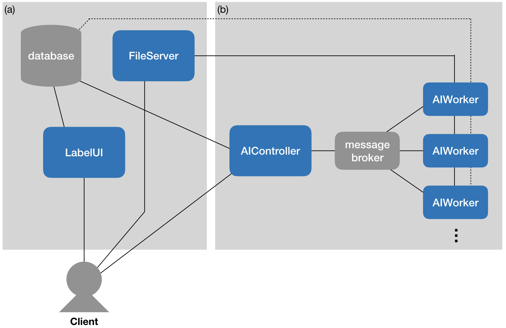

# AIde - Assisted Interface that does everything

AIde is a modular, multi-tier web framework for labeling image datasets with AI assistance and Active Learning support.


TODO: GIF/video of platform


AIde is primarily developed and maintained by [Benjamin Kellenberger](https://www.wur.nl/en/Persons/Benjamin-BA-Benjamin-Kellenberger-MSc.htm), in the context of the [Microsoft AI for Earth](https://www.microsoft.com/en-us/ai/ai-for-earth) initiative.


## Highlights


* **Fast:** AIde has been designed with speed in mind, both in terms of computations and workflow.
* **Flexible:** the framework allows full customizability, from hyperparameters and models over annotation types to libraries. For example, it supports bounding boxes as model predictions and classification labels for user annotations; you may exchange the AI backend in any way you want (or [write your own](doc/custom_model.md)); etc.
* **Modular:** AIde is separated into individual _Modules_, each of which can be run on separate machines for scalability, if needed. It even supports on-the-fly additions of new computational workers for the heavy model training part!


## Installation

See the instructions [here](doc/install.md).


## Framework Overview

In its full form, AIde comprises individual instances (called _modules_) in an organization such as follows:



where the following modules are run:
* **LabelUI**: module responsible for delivering and accepting predictions and annotations to and from the user/labeler;
* **AIWorker**: node that runs the AI model in the background to train and predict data;
* **AIController**: coordinator that distributes and manages jobs to and from the individual _AIWorker_ instance(s);
* **Database**: stores all metadata (image paths, viewcounts, user annotations, model predictions, user account data, etc.);
* **FileServer**: provides image files to both the _LabelUI_ and _AIWorker_ instances;
* message broker: AIde makes use of [Celery](http://www.celeryproject.org/), a distributed task queue piggybacking on message brokers like [RabbitMQ](https://www.rabbitmq.com/) or [Redis](https://redis.io/).


The framework can be configured in two ways:
1. As a static labeling tool (_i.e._, using only the modules in (a.)). In this case there will be no AI assistance for learning and prioritizing the relevant images.
2. As a full suite with AI support, using all modules.

Also note that the individual modules need not necessarily be run on separate instances; it is possible to combine the components in any way and launch multiple (or all) modules on one machine. Also, the example shows three _AIWorker_ instances, but the number of workers can be chosen arbitrarily, and workers may be added or removed on-the-fly.


## Launching AIde

Every component of AIde needs to have the `AIDE_CONFIG_PATH` environment variable set correctly, specifying the path (relative or absolute) to the configuration INI file (see [configure](doc/configure_settings.md)). This can be done temporarily:
```
    export AIDE_CONFIG_PATH=config/settings.ini
```

Or permanently (requires re-login):
```
    echo "export AIDE_CONFIG_PATH=config/settings.ini" > ~/.profile
```


### Frontend
The front-end modules of AIde (_LabelUI_, _AIController_, _FileServer_) can be run by invoking the `runserver.py` file with the correct arguments.

To launch just the frontend:
```
    conda activate aide
    export AIDE_CONFIG_PATH=config/settings.ini
    python runserver.py --instance=LabelUI
```

Instance arguments can be chained with commas. For example, to launch the _LabelUI_, _AIController_ and _FileServer_ on the same machine, replace the last line with:
```
    python runserver.py --instance=LabelUI,AIController,FileServer
```


### AIWorker
_AIWorker_ modules need to be launched using Celery:
```
    conda activate aide
    export AIDE_CONFIG_PATH=config/settings.ini
    celery -A modules.AIController.backend.celery_interface worker
```


# Contributing

This project welcomes contributions and suggestions.  Most contributions require you to agree to a
Contributor License Agreement (CLA) declaring that you have the right to, and actually do, grant us
the rights to use your contribution. For details, visit https://cla.opensource.microsoft.com.

When you submit a pull request, a CLA bot will automatically determine whether you need to provide
a CLA and decorate the PR appropriately (e.g., status check, comment). Simply follow the instructions
provided by the bot. You will only need to do this once across all repos using our CLA.

This project has adopted the [Microsoft Open Source Code of Conduct](https://opensource.microsoft.com/codeofconduct/).
For more information see the [Code of Conduct FAQ](https://opensource.microsoft.com/codeofconduct/faq/) or
contact [opencode@microsoft.com](mailto:opencode@microsoft.com) with any additional questions or comments.